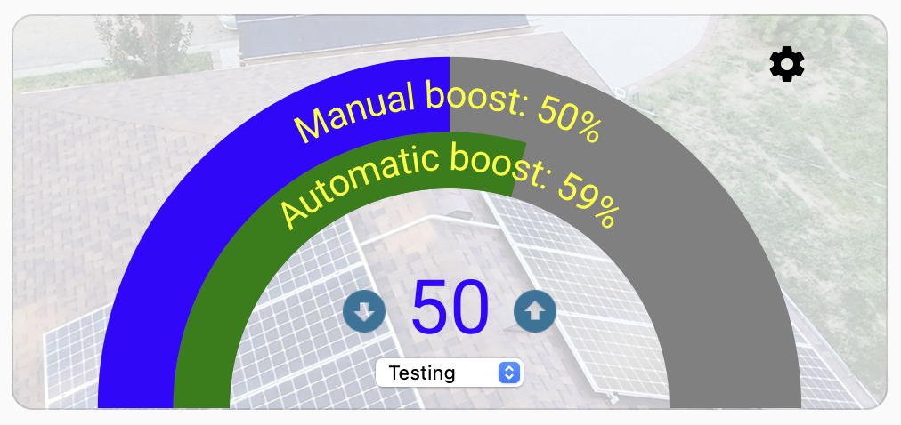

“””
The TOU Scheduler for home assistant helps to minimize the cost of grid power to your home. It works with solar systems that have a battery that is able to supply most of the electricity needed during a typical day.

TOU Scheduler works by comparing forecasted solar power generation to recent load usage. It strives to charge your batteries during off-peak rates so that your battery is able to run your home without using the grid during higher cost times of the day. It strives to charge only as much as necessary to get you through the day. Many days my system uses no grid power, but if the next day will be cloudy, it will charge the battery enought to get me through that day.

The system has a manual overide so that you can manually set a different charge when you know the circumstances are unusual. For example, if you know you have snow on your panels but tomorrow will be sunny, the system won't charge automatically. It doesn't know about the snow on your panels. You need to manually override the calculated setting and use your best judgement to set the off-peak charge.

I built this for my own use. At that time I had a Sol-Ark 12k inverter, 15kWh of battery storage, 8 kW of solar capacity, and used about 20kWh daily. I have modified it over the course of a year, and it now works reliably for me. "Your milage may vary."

If you have a different brand of inverter, you will need to modify this system. It currently only reaches out to mysolark.com to interact with the inverter.

When you install this custom component, you will need to supply your login credentials to your mysolark.com account. You will also need to supply your api key and resource id for your solcast.com account. (I found that Solcast.com had the best data for predicting solar power generation for my context.)

There is an accompanying custom card that you can install in your dashboard. This card allows you to easily see and adjust key options. You can set these options through the Developer Tools / Actions / Time of Use Scheduler: set_boost_settings. This method is not as convenient.

The custom dashboard card interface displays information including:
	Automatically calculated off-peak State of Charge target for tomorrow
	Manually set off-peak State of Charge target
	Whether the system is in automatic or manual mode (there are also testing and off modes, not normally used)
	Number of days of load usage that you want to be considered when calculating the charge needs for tomorrow
	Your confidence level in the Solcast forecast
	The minimum charge level you want the system to strive to keep in your battery at all times

The user interface is loosely modeled on a thermostat. There are concentric rings showing both the calculated (automatic) charge setting and the manual (override) setting. Up and down arrows are visibile when you are in manual (or testing) mode so that you can adjust the manual charge setting. There is a settings icon that brings up a pop-up where you can set the options.

Just for fun, if you have an image associated with your mysolar.com account, that image will show in the background of the custom dashboard card.

Services:
By the way, this integration also includes several services that you can use to adjust options in the integration. The custom dashboard card handles all of that automatically for you, but if for some reason you want access to change those through some other means (such as Alexa integration), you can use these services to accomplish that.
“””
